```{r setup, include=FALSE}
knitr::opts_chunk$set(echo = TRUE, warning = FALSE)
```

<style>
  body{
    text-align: justify;
    font-size: 16px
    }
  h4 {font-size:20px}
  h5 {font-size:18px}
  strong {fontsize:16px}
</style>

# 1. Introdução

<!-- Escrever o objetivo desse curso/material (preparar pra realizar consultorias), escrever também dos passos que serão tratados e deixar o link de uma consultoria pronta no drive. -->

Este curso foi pensado com o objetivo de ensinar o processo de desenvolvimento de uma consultoria, capacitando os membros da Estats a faze-la e elaborar relatórios com eficiência e conhecimento.
O material contém instruções para o tratamento de dados, para a análise descritiva e para a escrita de relatórios no Overleaf, bem como, materiais pré-prontos, sites e links úteis.

<br><br>

# 2. Tratamento de dados

<!-- Colocar o processo de tratamento de dados que conversamos nos offices, dando exemplos com imagens e exemplos de problemas. -->

O primeiro passo de uma consultoria é o tratamento de dados, esperamos um banco organizado e sem muitos dados faltantes, mas normalmente não é isso que encontramos, e por isso precisamos arrumar esse banco.


# 2.1. Google sheets

A primeira plataforma que podemos usar para o tratamento é o goggle sheets, o excel do google, é um aplicativo gratuito e simples de ser usado, podendo ser acesso diretamente pelo navegador.
Aqui iremos ensinar algumas funções da ferramenta que pode ser útil para problemas específicos e que já nos deparamos anteriormente.
<br><br>


A vizualização inicial de um banco de dados no Sheets é a seguinte,
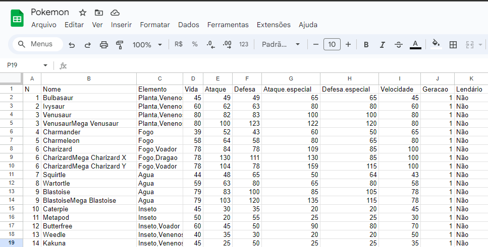

## **Exemplos de Problemas** 

## Padronizando dados

Muitas vezes, como em questionários de respostas aberta, temos dados que significam a mesma coisa com palavras ou escritas diferentes, o que para fazer uma análise é péssimo, por isso é necessário padronizar esses valores, podemos verificar e fazer isso de forma fácil no sheets.

Primeiramente, para visualizar se temos escritas diferentes podemos selecionar a coluna que queremos ver e depois com o botão direito ir na opção estatísicas da coluna.

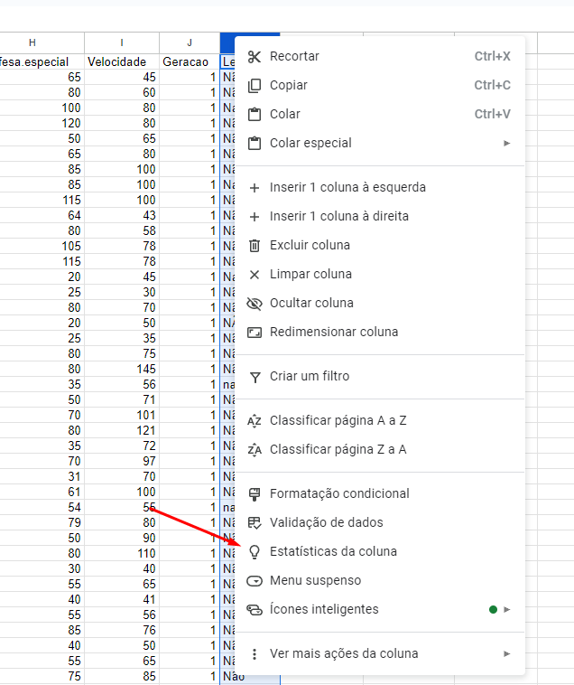

Com isso podemos ver todos os dados únicos na coluna e a frequência deles, a visualização é a seguinte,

```{r, echo=FALSE, out.width="45%", fig.align='default'}
library(knitr)
include_graphics(c("img/tratamento/6-1.png", "img/tratamento/6-2.png"))
```

Podemos ver que a palavra "Não" está escrita de inúmeras formas diferentes, e queremos padronizar isso, é possível usar a expressão "=SE", a fórmula primeiro tem a comparação, um ";", o valor se a comparação for verdadeira, um ";" e o valor se a comparação for falsa.


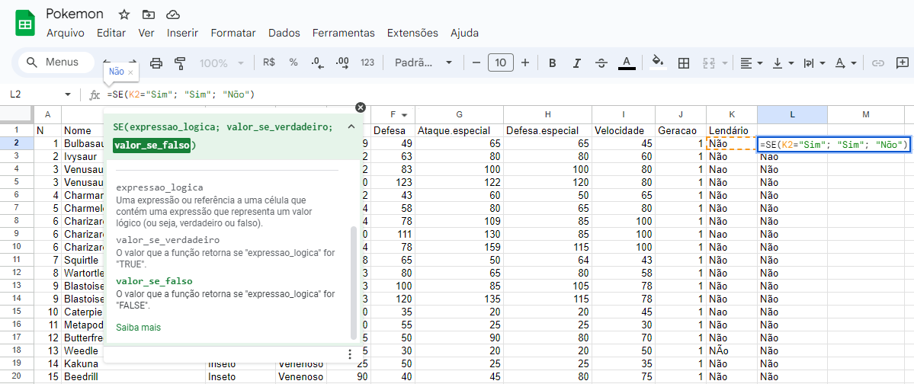

Assim, teremos uma coluna corrigida, isso para expressões mais simples, em caso de ser necessário transformações mais complexas pode ser mais facilmente realizado no R.
<BR>

Além dessa forma é possível utilizar outra opção, podendo até padronizar mais de uma coluna ao mesmo tempo, na opção editar há "Localizar e substituir"

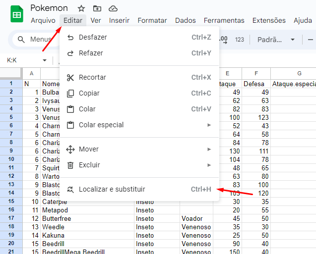

Temos a seguinte tela,
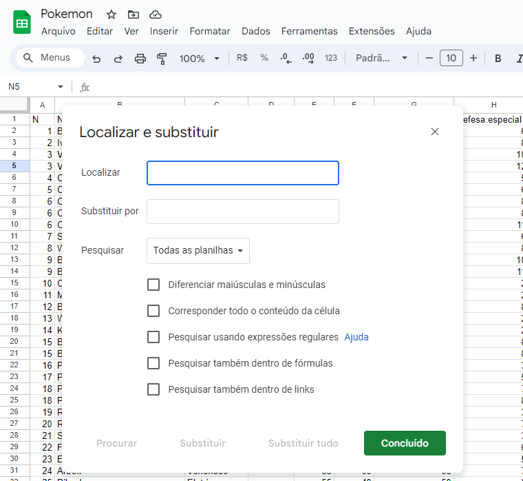
Aqui podemos escrever a expressão que queremos buscar em localizar, a expressão pela qual queremos substitui-la, em pesquisar podemos definir em todas planilhas, na planilha atual ou apenas em um intervalo, como uma coluna, além disso selecionar as opções abaixo se for do nosso interesse.

<br><br>

## Separar em colunas por separador

Há momentos, como em questonário de múltipla escolha, que temos colunas com várias respostas na mesma coluna com um separador definido entre elas e queremos separá-las em colunas diferentes.

Por exemplo, na coluna Elemento do banco abaixo,
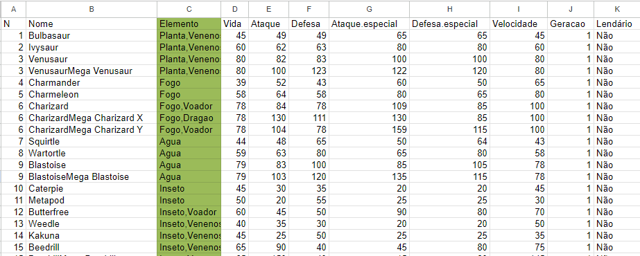


Selecionando a coluna que queremos e indo na opção Dados na parte superior, temos "Dividir texto em colunas",

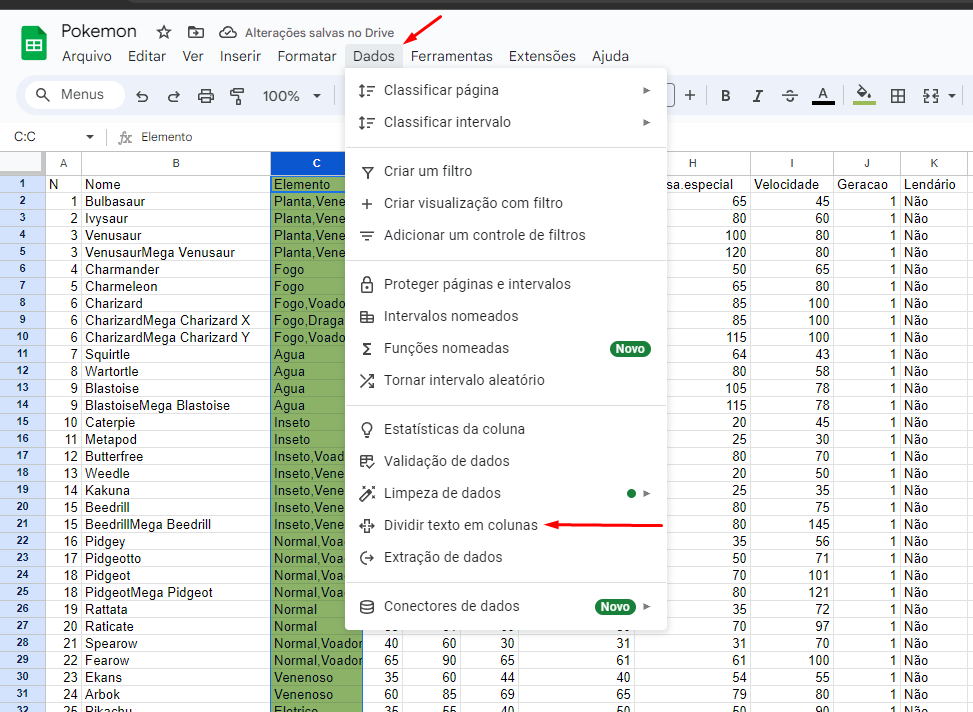
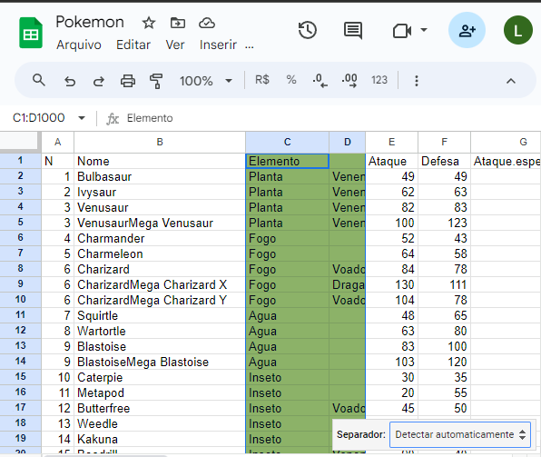
A coluna irá ser separada automaticamente dependendo do separador, no entanto, abaixo há a opção de definir o separador caso o que você deseja não tenha sido selecionado automaticamente.


<br><br>


# 2.2. R

# 3. Descritiva

Colocar o processo da descritiva que conversamos, com exemplos e problemas.

## 3.1. Gráficos no ggplot2

### Pacotes
```{r Pacotes, message=FALSE}
library(ggplot2)
library(dplyr)
library(gridExtra)
library(forcats)

pct_format = scales::percent_format(accuracy = .1)

```

### Dados usados nos exemplos

A base de dados r mtcars consiste de uma planilha disponível no r base cujo os dados foram extraídos da revista Motor Trend US magazine de 1974. Os dados inseridos consistem do consumo de combustível, 10 características físicas e/ou performance de 32 automóveis (modelos de 1973-1974). A planilha do r mtcars consiste em 32 obsevações (modelo do carro) com 11 variáveis numéricas.

```{r}
head(mtcars)
str(mtcars)
```

### Gráfico de barras univariado

Um gráfico de barras univariado é uma representação visual utilizada para mostrar a distribuição de uma variável categórica ou quantitativa discreta. Ele é chamado de "univariado" porque apresenta apenas uma variável. Segue uma função que automatiza o processo:

```{r barras univariado}
uni_bar <- function(banco, var, ylab= 'Frequência', xlab = '',
                    color = '#767F8B', order = NULL, flip = F){
  
  banco <- banco[banco[var] != '',][var]
  
  if(typeof(banco[3,var]) == 'character')
  {  
    prim.maiuscula <- function(x) {
      x <- tolower(x)
      substr(x, 1, 1) <- toupper(substr(x, 1, 1))
      x
    }
    
    banco[var] <- sapply(banco[var], FUN = prim.maiuscula)
  }
  if(!is.null(order))
  {banco[var] <- fct_relevel(factor((banco[[var]]), levels=order))}
  banco <- data.frame(table(banco[var]))
  names(banco)[1] <- var
  
  
  if(flip == F)
  { ax <- ggplot(banco, aes(x = .data[[var]], y = Freq)) + 
    geom_bar(fill=color, stat='identity') + 
    theme_minimal()+
    labs(x= xlab, y = 'Frequência') + 
    ylim(0.0, max(banco$Freq)*1.05)+
    geom_label(aes(
      label = sprintf(
        '%d (%s)',
        Freq,
        pct_format(Freq / sum(Freq))
      )), stat='identity', fill='white', vjust=1.2, label.size = 0.25)}
  else if(flip == T)
  { ax <- ggplot(banco, aes(x = .data[[var]], y = Freq)) + 
    geom_bar(fill=color, stat='identity') + 
    theme_minimal() +
    labs(x= xlab, y = 'Frequência') +
    ylim(0.0, max(banco$Freq)*1.05)+
    geom_label(aes(
      label = sprintf(
        '%d (%s)',
        Freq,
        pct_format(Freq / sum(Freq))
      )), stat='identity', fill='white', label.size = 0.25)+
    coord_flip()}
  
  print(ax)
  
  arquivo <- paste0('img/uni/', var, '.pdf')
  ggsave(arquivo)

  
}

```

```{r, message=FALSE}
uni_bar(mtcars, 'cyl')
```


### Gráfico de barras bivariado

Um gráfico de barras bivariado é utilizado para comparar duas variáveis, mostrando a relação entre elas. Diferente do gráfico de barras univariado, que foca em uma única variável, o gráfico de barras bivariado busca ilustrar como duas variáveis se relacionam, geralmente categóricas. Segue uma função que automatiza o processo:

```{r Barras bivariado}
bi_bar <- function(banco, x, y, ylab= 'Frequência', xlab = '', label_fill = '',
                   color = c('#767F8B', '#B3B7B8'), label_size = 0.25,
                   order = NULL, flip = F){
  
  banco <- banco[banco[x] != '' & banco[y] != '',][,c(x,y)]
  prim.maiuscula <- function(x) {
    x <- tolower(x)
    substr(x, 1, 1) <- toupper(substr(x, 1, 1))
    x
  }
  
  if(typeof(banco[3,x]) == 'character') {banco[x] <- sapply(banco[x],
                                                            FUN = prim.maiuscula)}
  if(typeof(banco[3,y]) == 'character') {banco[y] <- sapply(banco[y],
                                                            FUN = prim.maiuscula)}
  
  if(!is.null(order))
  {banco[x] <- fct_relevel(factor((banco[[x]]), levels=order))}
  banco <- data.frame(table(banco))
  names(banco) <- c(x, y, 'Freq')
  
  
  if(flip == F)
  { 
      ax <- ggplot(banco, aes(x = .data[[x]], y = Freq, fill = .data[[y]])) + 
      geom_bar( stat='identity', position =  "dodge") + 
      theme_minimal()+
      labs(x= xlab, y = 'Frequência', fill = label_fill) + 
      ylim(0.0, max(banco$Freq)*1.05)+
      geom_label(aes(
        label = sprintf(
          '%d (%s)',
          Freq,
          pct_format((Freq / sum(Freq)))
        ), group = y), position = position_dodge2(width = 0.9),
        size=2.5,col = "black", fill='white')+
      scale_fill_manual(values=color)+
      theme_minimal()
    
  }
    
  else if(flip == T)
  {     ax <- ggplot(banco, aes(x = .data[[x]], y = Freq, fill = .data[[y]])) + 
    geom_bar( stat='identity', position =  "dodge") + 
    theme_minimal()+
    labs(x= xlab, y = 'Frequência', fill = label_fill) + 
    ylim(0.0, max(banco$Freq)*1.05)+
    geom_label(aes(
      label = sprintf(
        '%d (%s)',
        Freq,
        pct_format((Freq / sum(Freq)))
      ), group = y), position = position_dodge2(width = 0.9, ),
      size=2.5,hjust= 0.5, col = "black", fill='white')+
    scale_fill_manual(values=color,)+
    theme_minimal()+
    coord_flip()+
    guides(fill = guide_legend(reverse = TRUE))}
  
  print(ax)
  
  arquivo <- paste0('img/bi/', x, 'X', y, '.pdf')
  ggsave(arquivo, dpi = 500)
  
  
}
```

```{r, message=FALSE}
bi_bar(mtcars, 'cyl', 'am')
```


### Boxplot

Também conhecido como diagrama de caixa ou gráfico de caixa, é uma representação gráfica utilizada para descrever a distribuição, a dispersão e a presença de possíveis outliers em um conjunto de dados. Ele resume os principais aspectos de um conjunto de dados através de cinco números: mínimo, primeiro quartil (Q1), mediana (Q2), terceiro quartil (Q3) e máximo. O boxplot é particularmente útil para comparar distribuições entre várias categorias. Segue uma função que automatiza o processo:

```{r boxplot}
uni_boxplot <- function(banco, var, xlab= '', ylab = '', color = '#767F8B', flip = F){
  
  banco <- banco[banco[var] != '',][var]
  
  if(typeof(banco[3,var]) == 'character')
  {  
    prim.maiuscula <- function(x) {
      x <- tolower(x)
      substr(x, 1, 1) <- toupper(substr(x, 1, 1))
      x
    }
    
    banco[var] <- sapply(banco[var], FUN = prim.maiuscula)
  }
  
  if(flip == F)
  { 
    ax <- ggplot(banco, aes(x = '', y = .data[[var]])) + 
    stat_boxplot(geom='errorbar', linetype=1, width=0.25)+
    geom_boxplot(fill = color) +
    theme_minimal()+
    labs(x= xlab, y = ylab) }
    
  else if(flip == T)
  {     
    ax <- ggplot(banco, aes(x = '', y = .data[[var]])) + 
    stat_boxplot(geom='errorbar', linetype=1, width=0.25)+
    geom_boxplot(fill = color) +
    theme_minimal()+
    labs(x= xlab, y = ylab) +
    coord_flip() }
  
  print(ax)
  
  arquivo <- paste0('img/uni/', var, '.pdf')
  ggsave(arquivo)
  
}
```

```{r, message=FALSE}
uni_boxplot(mtcars, 'mpg')
```


### Boxplot bivariado

Também conhecido como boxplot condicional ou gráfico de caixa condicional, é uma extensão do boxplot padrão que permite visualizar a distribuição de uma variável quantitativa condicionalmente a uma variável categórica. Essa técnica é útil para entender como a distribuição de uma variável numérica varia em relação a diferentes categorias. Segue uma função que automatiza o processo:

```{r boxplot bivariado}
bi_boxplot <- function(banco, x, y, xlab= '', ylab = '', color = '#767F8B', flip = F){
  
  banco <- banco[!is.na(banco[x]) & !is.na(banco[y]),][,c(x,y)]
  
  prim.maiuscula <- function(x) {
    x <- tolower(x)
    substr(x, 1, 1) <- toupper(substr(x, 1, 1))
    x
  }
  
  if(typeof(banco[3,x]) == 'character') {banco[x] <- sapply(banco[x],
                                                            FUN = prim.maiuscula)}
  if(typeof(banco[3,y]) == 'character') {banco[y] <- sapply(banco[y],
                                                            FUN = prim.maiuscula)}
  
  if(flip == F)
  { 
    ax <- ggplot(banco, aes(x = .data[[x]], y = .data[[y]])) + 
      stat_boxplot(geom='errorbar', linetype=1, width=0.25)+
      geom_boxplot(fill = color) +
      theme_minimal()+
      labs(x= xlab, y = ylab) }
  
  else if(flip == T)
  {     
    ax <- ggplot(banco, aes(x = .data[[x]], y = .data[[y]])) + 
      stat_boxplot(geom='errorbar', linetype=1, width=0.25)+
      geom_boxplot(fill = color) +
      theme_minimal()+
      labs(x= xlab, y = ylab) +
      coord_flip() }
  
  print(ax)
  
  arquivo <- paste0('img/bi/', x, 'X', y, '.pdf')
  ggsave(arquivo)
  
}

```


```{r, message=FALSE}
bi_boxplot(mtcars, 'cyl', 'drat')
```


### Histograma

É um tipo de gráfico de barras usado em estatística para representar a distribuição de frequência de um conjunto de dados contínuos ou discretos. Ele mostra a frequência com que determinados intervalos de valores ocorrem em um conjunto de dados, dividindo o intervalo de valores em segmentos chamados "bins" ou "classes". Cada bin representa um intervalo de valores e a altura de cada barra indica a frequência ou a proporção de observações que caem dentro desse intervalo. Segue uma função que automatiza o processo:

```{r histograma}
histograma <- function(banco, var, xlab= '', ylab = 'Frequência',
                       color = '#767F8B', media = T){
  
  banco <- banco[banco[var] != '',][var]
  
  
  if(media == T){
    ax <- ggplot(banco, aes(x = .data[[var]])) + 
      geom_histogram(col = 'black',
                     fill = color,
                     alpha = 0.9)+
      geom_vline(xintercept = mean(banco[[var]], na.rm = T),
                 color = 'red', linetype = 'dashed', lwd = 1.2)+
      theme_minimal()+
      labs(x= xlab, y = ylab) 
  }
  else if(media == F){
    ax <- ggplot(banco, aes(x = .data[[var]])) + 
      geom_histogram(col = 'black',
                     fill = color,
                     alpha = 0.9)+
      theme_minimal()+
      labs(x= xlab, y = ylab) 
  }
    
  print(ax)
  
  arquivo <- paste0('img/uni/', var, '.pdf')
  ggsave(arquivo)
}

bi_bar2 <- function(banco, x, y, ylab= 'Frequência', xlab = '', label_fill = '',
                    color = c('#767F8B', '#B3B7B8'), label_size = 0.25, flip = F,
                    order = NULL, order_fill = NULL){
  
  banco <- banco[banco[x] != '' & banco[y] != '',][,c(x,y)]
  prim.maiuscula <- function(x) {
    x <- tolower(x)
    substr(x, 1, 1) <- toupper(substr(x, 1, 1))
    x
  }
  
  if(typeof(banco[3,x]) == 'character') {banco[x] <- sapply(banco[x],
                                                            FUN = prim.maiuscula)}
  if(typeof(banco[3,y]) == 'character') {banco[y] <- sapply(banco[y],
                                                            FUN = prim.maiuscula)}
  
  if(!is.null(order))
  {banco[x] <- fct_relevel(factor((banco[[x]]), levels=order))}
  
  if(!is.null(order_fill))
  {banco[y] <- fct_relevel(factor((banco[[y]]), levels=order_fill))}
  
  banco <- data.frame(table(banco))
  names(banco) <- c(x, y, 'Freq')
  
  if(flip == F)
  { 
    ax <- ggplot(banco, aes(x = .data[[x]], y = Freq, fill = .data[[y]])) + 
      geom_bar( stat='identity', position =  "dodge") + 
      theme_minimal()+
      labs(x= xlab, y = 'Frequência', fill = label_fill) + 
      ylim(0.0, max(banco$Freq)*1.05)+
      geom_label(aes(
        label = sprintf(
          '%d (%s)',
          Freq,
          pct_format((Freq / sum(Freq)))
        ), group = y), position = position_dodge2(width = 0.9),
        size=2.5,col = "black", fill='white')+
      scale_fill_manual(values=color)+
      theme_minimal()
    
  }
  else if(flip == T)
  {     ax <- ggplot(banco, aes(x = .data[[x]], y = Freq, fill =.data[[y]])) + 
    geom_bar( stat='identity', position =  "dodge") + 
    theme_minimal()+
    labs(x= xlab, y = 'Frequência', fill = label_fill) + 
    ylim(0.0, max(banco$Freq)*1.05)+
    geom_label(aes(
      label = sprintf(
        '%d (%s)',
        Freq,
        pct_format((Freq / sum(Freq)))
      ), group = y), position = position_dodge2(width = 0.9, ),
      size=2.5,hjust= 0.5, col = "black", fill='white')+
    scale_fill_manual(values=color,)+
    theme_minimal()+
    coord_flip()+
    guides(fill = guide_legend(reverse = TRUE))}
  
  print(ax)
  
  arquivo <- paste0('img/bi/', x, 'X', y, '.pdf')
  ggsave(arquivo)
}
```

```{r, message=FALSE}
histograma(mtcars, 'mpg')
```


**3.1.1. Estruturando dados para gráficos**

Colocar alguns exemplos das estruturas dos dados errados e como corrigi-los com base no que foi falado no tratamento de dados.

## 3.2. Tabelas de Frequência

Para adicionar uma tabela de frequência a um relatório no overleaf, utilizamos o site [Tables Generator](https:www.tablesgenerator.com) , nele é possível digitar os dados da tabela ou colar de uma planilha do google sheets:


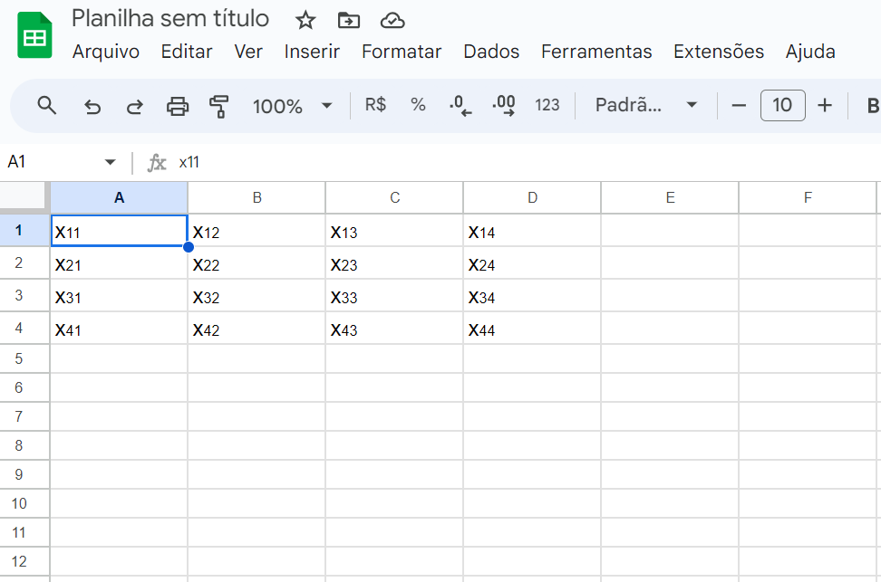


Criamos uma matriz para demonstrar, e então copiamos do google sheets e colamos no tables generator:


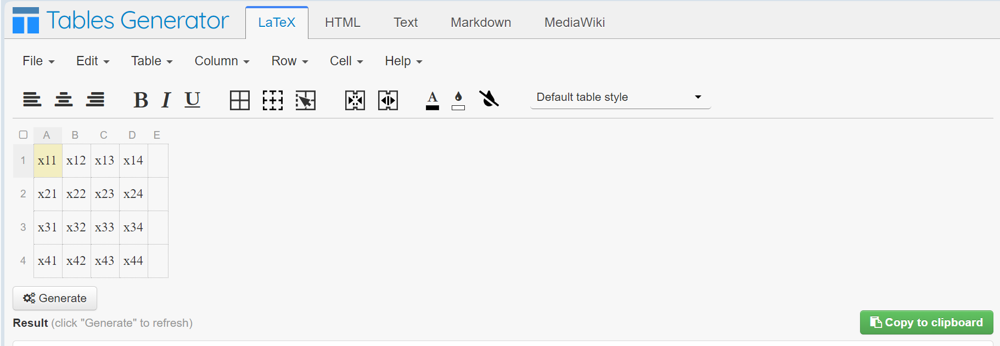


Agora, para manter o padrão mudamos o estilo para Booktabs table style e depois criamos a tabela apertando em generate:


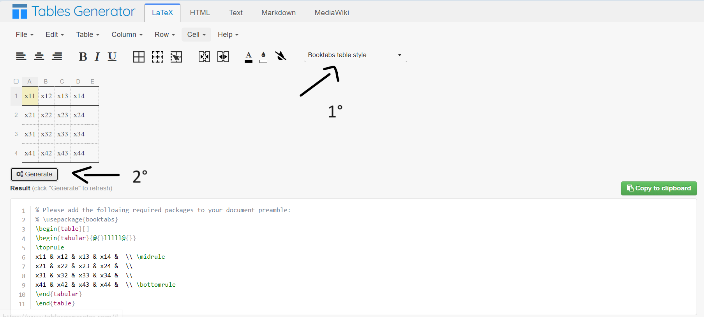


Então, copiamos a tabela gerada, apertando em copy to clipboard e colamos no overleaf, antes de compilar é necessário inserir um “h” em


 \begin{table}[]
 
 
ficando,


\begin{table}[h]


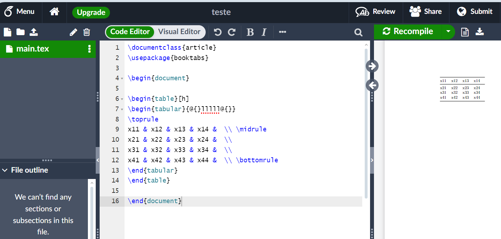


Por fim, só precisa compilar o arquivo e a tabela aparecerá.


## 3.3. Interpretação

Colocar exemplos de interpretação, como e quanto interpretar, dicas via exemplos para não escrever pouco e nem muito.

```{r}
uni_boxplot(iris, 'Sepal.Width')
```

No boxplot acima, a largura das sepalas possui uma mediana de aproximadamente 3 e  sua distribuição tem indícios de ser simétrica.

# 4. Overleaf

O Overleaf é um editor de texto online com a escrita Latex, e utilizamos ele para escrever os relatórios da Estats

## 4.1. Inserindo imagens no Overleaf


Para adicionar imagens a um relatório no Overleaf, o arquivo deve estar em formato PDF e, em seguida, será necessário fazer o upload dele na pasta de figuras:


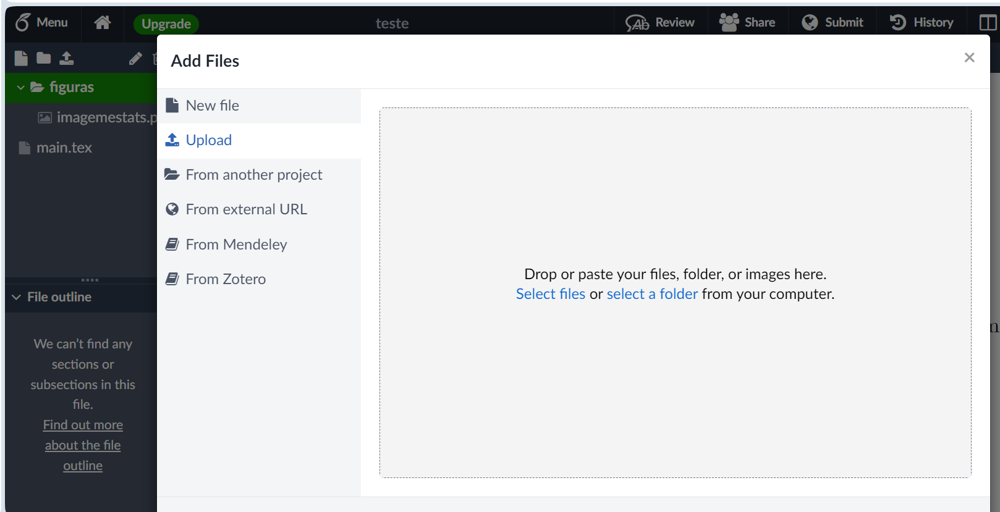


Podemos inserir arquivos do computador ou de outros projetos. Usando o pacote “graphicx”, escrevemos o código a seguir:


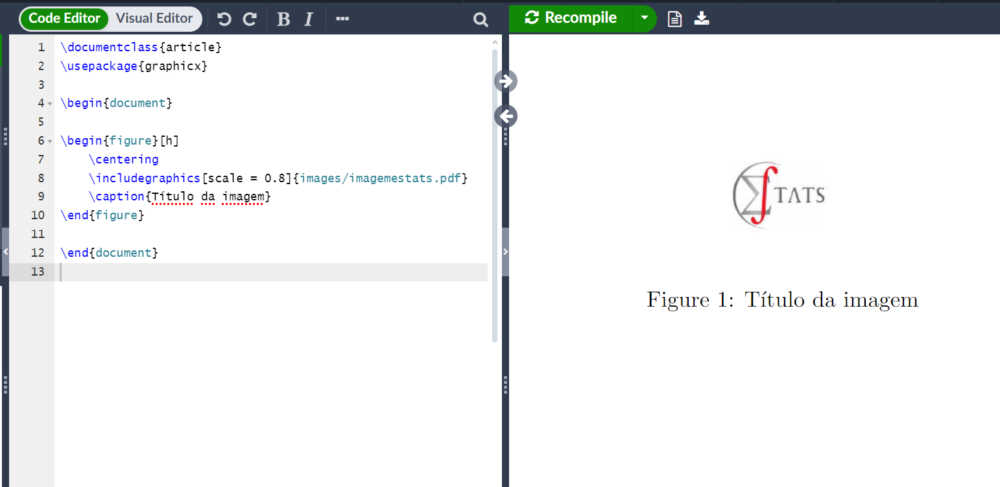
E então,
 no
 includegraphics[_]{_} indicar a escala da imagem, o  nome da pasta e do arquivo, 
 
 
no 
caption{_} adicionar o título da figura,


e em 
begin{figure}[_] adicionar o “h”.


Por fim, é só compilar o relatório.


## 4.2. Escrevendo comentários no Overleaf


Para fazer um cometário no relatório em overleaf, basta escrever um % no começo da linha.